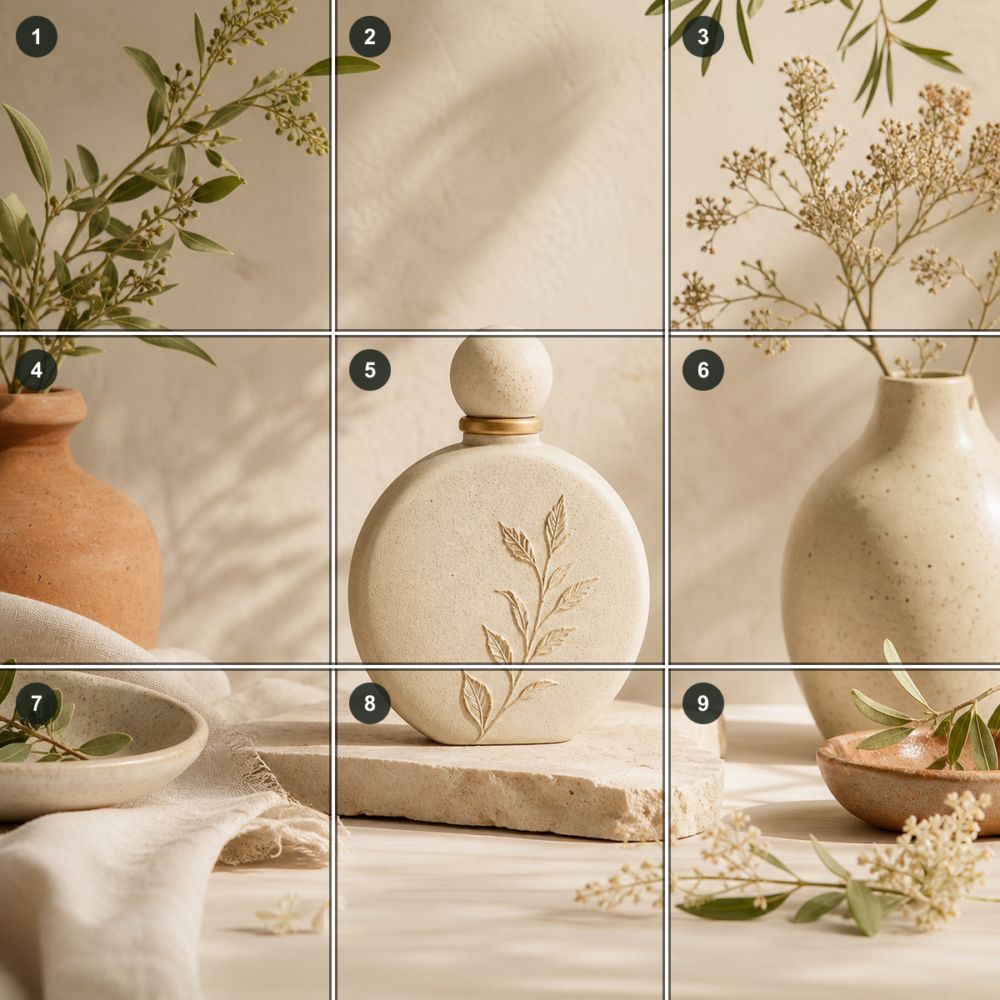
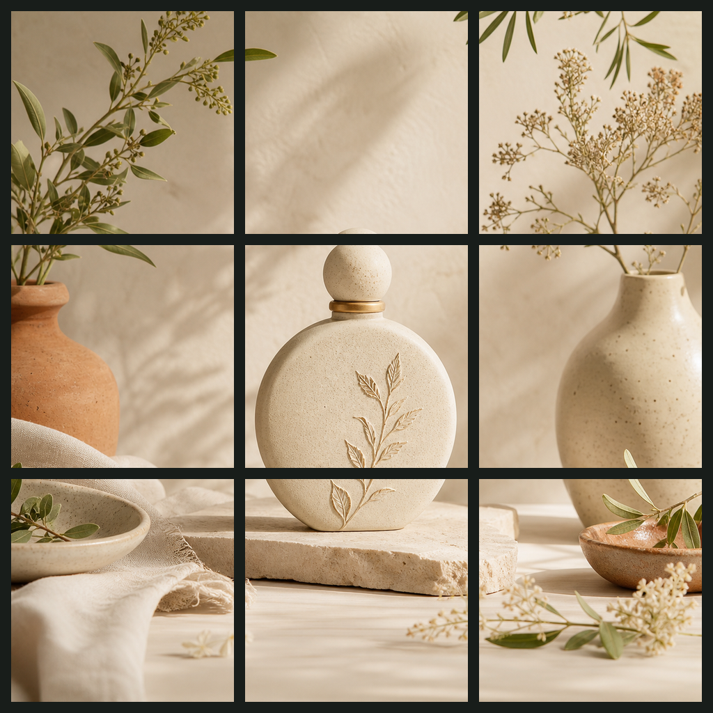
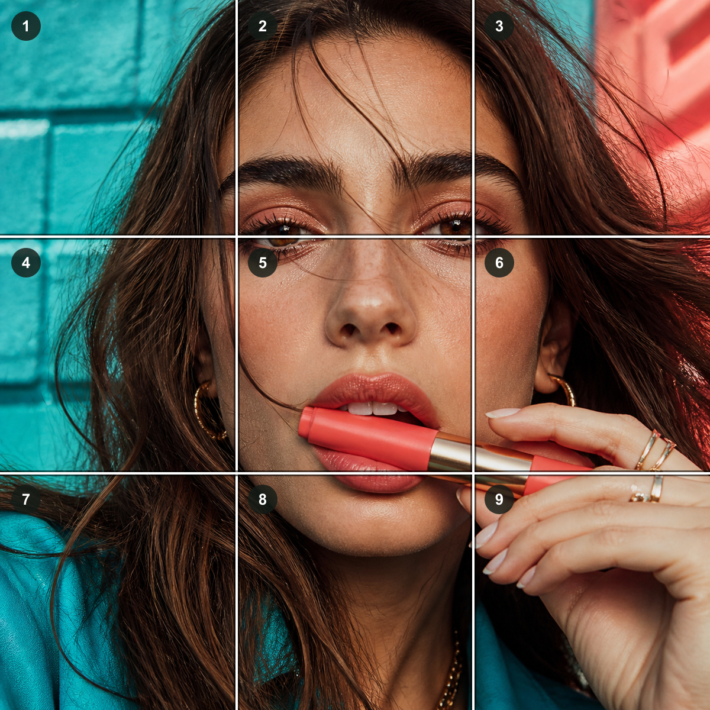
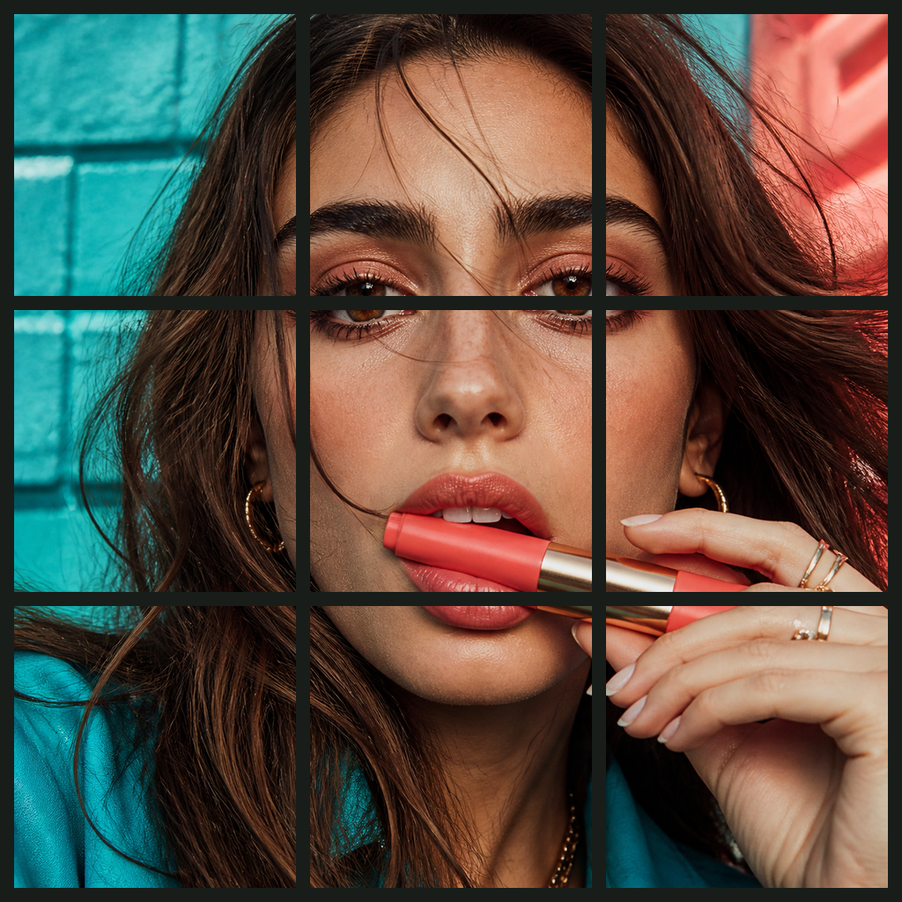

# 社交九宫格使用指南

## 这个能力解决什么

社交九宫格把一张经过确认的方形总图拆成 3 × 3 的九张独立 PNG。它适合把一个完整 campaign、作品或环境画面铺在个人主页网格中，不是把九张来源照片拼成一张，也不会自动发布。

## 原图限制

### 必须满足的技术条件

- 来源必须是产品支持的 JPEG、PNG 或 WebP，且通过现有 16 MiB / 4000 万像素预检。
- 用户必须先确认 1:1 方形保留区域；非方图会裁掉长边两侧内容。
- 方形结果至少 3 × 3 px。边长不能被 3 整除时，只居中舍弃最多 2 px，不拉伸、不补画。
- 九格输出固定为 PNG；产品不会识别主体、文字、脸部或平台主页布局。

### 清晰度条件

每张切片边长约等于方形总图边长的三分之一：

| 方形总图 | 每格约为 | 适用判断 |
| --- | --- | --- |
| 1080 × 1080 | 360 × 360 | 仅适合功能预览，不适合作为高质量发布目标 |
| 2048 × 2048 | 682 × 682 | 可做一般预览，但细节余量有限 |
| 3240 × 3240 | 1080 × 1080 | 推荐的高质量制作目标 |

当前产品控件默认总图 1080 px、最大 2048 px，因此目前是可验证的切图工具，还不是完整的高质量发布模板。正式完善时应把总图目标调整到 3240 px，并实时显示每格实际像素；原图不足时只警告，不应偷偷放大并声称增加细节。

### 构图条件

适合的原图通常具备：

- 一个完整的整体画面，而不是只靠单个局部成立；
- 关键主体、脸部、文字和商品标识避开两条横向与两条纵向接缝；
- 外围格也有有意义的颜色、纹理或环境内容；
- 允许用户为了接缝重新移动方形裁剪区域；
- 即使单格被单独看到，也不会出现误导、残缺文字或无法辨认的关键细节。

不适合直接处理的原图包括：紧贴画面的单人脸部、身份证件或文档、密集小字海报、关键商品正好跨接缝、必须让每一条帖子独立讲完整故事的内容。

## 对照演示

### 相对适合

主体大部分位于中央格，接缝主要穿过背景、器物边缘和低风险区域；外围格仍有植物、器皿和光影，可以共同组成完整主页画面。

### 明显不适合

横向接缝穿过眼睛，另一条接缝穿过嘴部和商品；拆分后多张图片只剩局部五官或头发。单图虽然好看，但直接九宫格处理会破坏信息。

## 适合的使用场景

- 品牌主页视觉：新品发布、活动预热、季节主题或品牌色铺陈；
- 艺术与摄影：风景、建筑、插画和纹理作品的整幅展示；
- 空间与陈列：室内、展览、餐桌、产品系列或环境故事；
- 连续叙事：九个局部共同构成一个主题，但不要求每格都含完整文字；
- 临时 campaign：发布期保持主页 3 × 3 结构，结束后可恢复普通发布。

## 不适合的使用场景

- 报名照、证件照、个人头像等以完整脸部为核心的任务；
- 商品详情图、菜单、报价单和说明书等要求单张独立清晰的内容；
- 文字密集或文字必须完整读取的海报；
- 主页会频繁插入其他帖子、置顶内容或混排模块的账号；
- 用户只想生成九张不同照片的拼贴；那是“拼图/相册模板”，不是本能力。

## 正确应用流程

1. 先确认目标平台当前仍使用可预测的 3 列主页网格。
2. 选择或制作一张适合整体展示的高分辨率方图，推荐 3240 × 3240 或更高。
3. 在产品中移动方形裁剪区域，打开 3 × 3 接缝预览。
4. 检查脸、文字、Logo、商品和重要边缘是否被接缝切坏。
5. 查看九张分块联系图，确认单格不会造成明显误解。
6. 下载九张 PNG / ZIP，再按目标平台的实际排序规则发布。对于“最新帖子排在左上”的平台，通常需要反向上传；产品必须把“画面位置编号”和“上传顺序”分开说明。

## 当前产品边界

当前版本完成方形裁剪、确定性 3 × 3 切分、单图 / ZIP 下载和文件重开校验。它没有自动内容适配、主体安全区判断、平台账号连接、发布排序保证或自动发帖。演示图均为项目原创 AI 合成素材，只用来解释构图，不证明真实平台发布质量。
