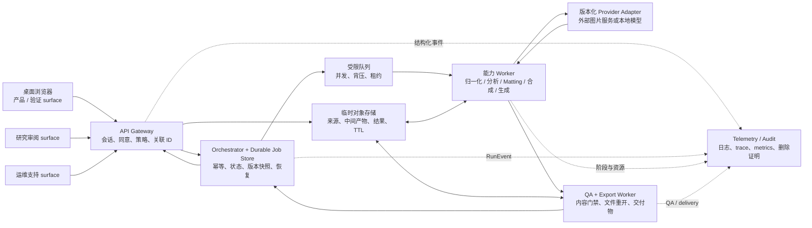

# 系统架构合同

> 文档角色：Single Image Studio 从研究执行到首轮桌面浏览器产品的逻辑架构事实源。本文件冻结组件职责、信任边界、状态归属、持久化与恢复原则，不表示这些组件已经实现。当前实现状态始终以 [STATUS.md](STATUS.md) 为准。

## 1. 首轮运行范围

首轮产品与验证范围只包含**桌面浏览器**：

- 当前基准环境是 Windows 桌面 Chromium；Chrome 与 Edge 最新稳定版是首批候选，精确版本必须写入 [QUALITY_AND_COMPATIBILITY.md](QUALITY_AND_COMPATIBILITY.md) 的 `CompatibilityProfile` 后才形成声明。
- 最小目标视口为 `1280 × 720`，另以 `1440 × 900` 检查常规桌面布局；浏览器缩放、DPR、键盘和鼠标范围由兼容性 profile 冻结。
- 手机、平板、iPhone / HEIC、Safari、Firefox、触摸专属交互和完整响应式产品均后置，不进入首轮 R1-product、O1 或 V1 分母。
- 现有同 Wi-Fi 手机入口仍是 R0 工程探针，不是本架构的发布 surface。

首轮仍只处理一张图片、一个已选效果和一个当前 run。多图、合集、产品套件、账户同步和跨设备续作不进入本架构的首个实现范围。

## 2. 逻辑拓扑



图中是逻辑职责，不预先指定云厂商、数据库、队列或监控产品。任何具体实现必须先进入 [CAPABILITY_REGISTRY.md](CAPABILITY_REGISTRY.md) 或相应 processor / 部署账本，并通过许可、数据流、成本和恢复审查。

## 3. 四条相互独立的平面

### 3.1 内容数据平面

承载来源图、`NormalizedImage`、`SubjectMap`、`AlphaMatte`、`ForegroundLayer`、生成候选、QA 预览和 `DeliveryArtifact`。内容资产必须：

- 按会话、用户作用域或研究夹具作用域隔离；
- 使用不可猜测的对象标识和短期授权访问；
- 绑定来源 revision、父资产、合同版本和 DataPolicy；
- 按资产类型设置 TTL，删除后由 tombstone 阻止迟到写回；
- 不进入普通日志、trace、metrics 或产品分析事件。

### 3.2 任务控制平面

承载 `ExecutionPlan`、幂等键、队列租约、状态迁移、重试、取消等待、reconciliation 与清理。控制平面不得把浏览器状态或供应商单次返回当成最终事实。

在任何可能产生费用的外部调用之前，服务端必须先持久化不可变 run 快照、幂等边界和 DataPolicy。若无法做到“先记账、后调用”，该执行路径不得进入真实用户研究。

### 3.3 证据平面

承载预注册、fixture manifest、运行引用、评审、失败、指标和 EvidenceManifest。研究证据与生产运维 telemetry 是两套账本：

- 证据平面允许对项目自有或明确授权夹具保存可重复研究资产；
- 真实用户图片默认不能因为发生错误或成为 escape 就进入证据集；
- EvidenceManifest 只引用允许范围内的 run 与资产，不从日志反向拼出用户内容。

### 3.4 运维与安全平面

承载结构化日志、trace、metrics、告警、访问审计、删除证明、事故记录和成本账本。其字段、保留、采样、访问与脱敏以 [OBSERVABILITY_AND_OPERATIONS.md](OBSERVABILITY_AND_OPERATIONS.md) 和 [DATA_FLOW_AND_SECURITY.md](DATA_FLOW_AND_SECURITY.md) 为准。

## 4. 组件职责

| 组件 | 必须负责 | 明确禁止 |
| --- | --- | --- |
| 桌面浏览器 | 文件选择、本地格式 / 字节 / 像素预检、同意展示、上传、任务设置、真实状态、比较和下载 | 自行宣布 C1 / QA 通过；长期保存用户图；把 Prompt、模型或内部错误暴露为普通设置 |
| API Gateway | 第一方 request / trace ID、会话与授权、同意快照、输入限额、策略检查、统一错误包、短期下载授权 | 持有长任务进程；在日志写图片、文件名、OCR / Prompt 全文或供应商秘密 |
| Orchestrator | run 快照、幂等、状态轴、队列、重试 / 查询、版本失效、清理与最终封存 | 处理像素；在 `UNKNOWN` 时自动创建新收费任务；让迟到结果重新绑定页面 |
| 临时对象存储 | 加密内容、作用域隔离、TTL、删除与 tombstone 对账 | 公共对象、永久 URL、跨 run 复用可写 key、把删除写成只删索引 |
| 能力 Worker | 只执行冻结 CapabilityContract；报告阶段、资源、产物和确定性错误 | 读取无关 run；静默更换模型 / 配方；绕过队列或 QA 直接发布 |
| Provider Adapter | 统一请求、幂等 / 查询 / 取消能力、request ID、限流、计费和服务条款边界 | 把供应商错误原样交给用户；把浮动 alias 冒充不可变版本 |
| QA / Export Worker | 运行任务 QA、生成 `QAReport`、正式导出、重开验证、hash 与下载门禁 | 用离线有真值指标冒充真实上传 QA；在 QA 故障时 fail open |
| 研究审阅 surface | 盲评、候选 / 失败比较、缺陷标注、版本与证据引用 | 公开用户内容；改写已冻结结果；承担正式产品状态 |
| 运维支持 surface | 按 `support_code` 查看脱敏时间线、版本、状态、计费与清理期限 | 默认查看原图；允许普通支持人员下载内容资产；绕过审计修改任务 |

## 5. 状态归属

一个 run 不能只保存单一 `status`。至少分开：

```text
execution_status       # 执行器真实终态
surface_binding_status # 当前页面是否仍允许绑定该 run
qa_status              # 结果是否通过任务 QA
delivery_status        # 交付物与下载是否成立
deletion_status        # 内容资产清理与供应商对账
```

- `SUPERSEDED` 与 `DETACHED` 属于 surface binding，不代表执行器已经停止。
- `BLOCKED` 可以来自资格、安全或 QA，但必须记录具体阶段，不能与网络失败混写。
- `UNKNOWN` 表示执行终态未知；只能查询 / reconciliation 或由用户明确创建新 run。
- `SUCCEEDED` 只说明执行完成，不能自动推出 QA、下载或删除成功。

所有状态迁移追加为版本化 `RunEvent`；最终 manifest 封存后，迟到的供应商对账只能追加 reconciliation 记录，不能覆写历史事件。

## 6. ID 与版本链

最低关联关系为：

```text
browser_session_id
  → user_execution_id
    → pipeline_attempt_id
      → provider_call_id
        → qa_job_id
          → delivery_id
            → deletion_job_id
```

另行保存第一方 `trace_id`、`gateway_request_id` 与供应商 `provider_request_id`。三者不得复用字段名 `request_id`。用户界面只展示低关联、可撤销查询的 `support_code`。

每次执行同时冻结：

```text
interface_build + api_schema_version + pipeline_version
effect_or_scene_version + capability_contract_versions
executor_or_provider_snapshot + recipe_or_algorithm_version
qa_profile_version + output_spec_version
catalog_and_allowlist_version + data_policy_version
```

其中任一版本无法解析、许可过期或状态降为 research-only / no-go 时，不得新建真实用户 run。

## 7. 逻辑 API 边界

首轮接口至少需要表达以下资源；具体 URL、方法和 JSON Schema 在实施前另行冻结：

1. 会话与数据告知版本；
2. 来源预检、上传授权与 `ImageAsset` 创建；
3. 来源分析、SourceCard 与资格结果；
4. 当前 surface allowlist 与版本化效果；
5. run 创建、查询、取消等待 / detach、用户明确重试；
6. QA 与结果比较摘要；
7. 短期下载授权与 `DeliveryArtifact`；
8. 用户删除、删除查询与本地 / 供应商边界；
9. 支持码查询所需的最小脱敏记录。

浏览器不能提交任意执行器、Prompt、模型 ID、对象 key、QA 通过值或 DataPolicy。服务端只接受 effect / scene 合同公开的用户参数，并从冻结版本解析实际管线。

## 8. 持久化与恢复不变量

- Job Store 必须在服务重启后恢复 `RUNNING / UNKNOWN / DETACHED` 与清理任务；R0 内存 Map 不满足该要求。
- 同一幂等键与同一输入快照返回同一 run；同一键与不同输入必须冲突，不能覆盖。
- 队列必须有租约、可见超时、并发上限、背压与孤儿回收；过载返回可预测的限流 / 暂不可用结果。
- 内容对象的创建、父子关系、下载授权、删除和 tombstone 需要可对账；数据库恢复不能让已删对象复活。
- Worker 重复执行不能产生跨 run 结果、重复下载授权或静默重复计费。
- telemetry 暂不可用时，内容任务是否继续由冻结策略决定；安全 / 删除审计不可写入时必须 fail closed。

发布、迁移、回滚和恢复细节见 [DEPLOYMENT_RELEASE_AND_RECOVERY.md](DEPLOYMENT_RELEASE_AND_RECOVERY.md)。

## 9. 性能与容量边界

端到端目标不能只测“模型用了多久”。桌面首轮必须分别观察：

- 浏览器选择文件、hash、预览、上传、交互反馈、结果显示与下载；
- Gateway 接收、授权、对象写入与响应；
- queue wait、冷 / 热 worker、执行器 / provider、QA、导出与总终态时间；
- 输入字节、像素、格式、并发、CPU / RAM / VRAM、网络和临时存储；
- 每次调用、每 attempt、每个可用结果、重试与 UNKNOWN 的成本。

具体 SLI / SLO、分母、错误预算、容量与告警由 [OBSERVABILITY_AND_OPERATIONS.md](OBSERVABILITY_AND_OPERATIONS.md) 和 O1Profile 冻结。没有真实测量前，本文件不写任意性能承诺。

## 10. 当前 R0 与目标架构的差异

当前 R0 只可作为实现线索：

- Node 进程内 Map 保存任务，重启后无法恢复；
- 图片以 base64 JSON 进入接口并和结果一起驻留进程内存；
- 没有正式队列、对象存储、租约、背压、TTL reaper 或供应商 reconciliation；
- `/api/status` 主要报告配置是否存在，不是完整 liveness / readiness / dependency health；
- 没有结构化请求日志、分布式 trace、metrics、告警、持久成本账本或支持查询面；
- R0 的前端 / 后端状态集不等于本文件的多轴生产状态。

因此 R0 测试通过不构成持久任务、容量、问题定位、R1-pipeline、O1 或 G1 证据。替换 R0 架构时可以复用经过重审的状态不变量，但不得把内存存储或 base64 请求形态带入真实用户路径。

## 11. 架构入场与退出条件

真实能力 adapter 开始处理授权研究夹具前，至少需要：

- 逻辑 API、RunManifest / RunEvent、ErrorEnvelope、RetryPolicy 和 DataPolicy 有版本；
- provider 的幂等、查询、取消、request ID、限流、计费和 UNKNOWN 边界已登记；
- 持久 job / object / queue 接口及清理不变量有测试替身；
- 桌面 CompatibilityProfile、O1Profile 与故障注入计划已预注册；
- 日志、trace、metrics 和安全审计字段经过脱敏测试。

进入真实用户研究前还必须完成：

- 对目标桌面 build 的 R1 acceptance matrix；
- 队列 / 重启 / UNKNOWN / 删除 / 回滚演练；
- 研究审阅与验证 surface 的权限、日志和资产边界；
- 对该环境有效的 R1-pipeline、O1 与 G1。

## 12. 尚待方向冻结的架构决定

以下决定不因“桌面浏览器优先”而自动获得答案，进入真实用户实现前需各自记录 ADR：

- 首轮是否采用匿名短期会话，还是要求账户；
- 处理与存储地域、供应商地域及跨境边界；
- 是否允许真实人物进入生成式创意效果；
- 是否存在生产人工审核，以及审核员能够看到哪些内容；
- 本地视觉 worker、托管 worker 与外部图片服务的实际组合。

任何选择都不能绕过 [EVIDENCE_AND_RELEASE.md](EVIDENCE_AND_RELEASE.md) 的 C/U/E/R/O/G/V 与逐资产 Release Gate。
