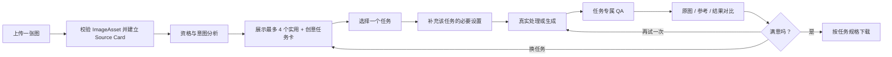

# 目标产品流程

> 文档角色：未来 R1-product 的体验契约，不是当前 R0 工程探针已经实现或验证的流程；状态见 [STATUS.md](STATUS.md)。  
> 目标：首轮在 Windows 桌面 Chromium 浏览器中完成一条单图、单任务、真实处理或生成、可比较、可下载的最短闭环。平台、surface 与可访问性边界见 [UI_SURFACES_AND_ACCESSIBILITY.md](UI_SURFACES_AND_ACCESSIBILITY.md)。  
> 产品是“单图任务路由器”，不是滤镜目录，也不授权复刻历史三栏工作台。

## 首轮客户端边界

- 首轮 R1-product、V1 与 O1 只覆盖 Windows 桌面 Chromium；Chrome 与 Edge 最新稳定版是候选，精确版本由研究或发布时的 `CompatibilityProfile` 冻结。
- 最小设计视口为 `1280 × 720` CSS px，另以 `1440 × 900` CSS px 验证代表性桌面布局。鼠标与键盘均进入验收范围。
- 移动端、平板、iPhone、Safari、Firefox、HEIC 与完整响应式适配后置，不得从桌面证据推断支持。
- 当前手机 LAN 页面仍是 R0 工程预览；手机能打开不构成产品、性能、安全或移动兼容证据，并且只能使用合成或明确非敏感资产。

## 主流程



“意图分析”不等于猜中用户目的：来自入口、快捷意图或用户明确选择的信号优先；没有明确信号时，系统只根据图片资格给出可解释建议，不声称知道用户想要什么。

## 用户只做五类决定

1. 选择一张图片。
2. 从成对参考中选择一个任务。
3. 只在任务确有需要时选择输出方式、底色或规格。
4. 点击处理或生成，并判断结果是否满意。
5. 下载，或换任务/再试一次。

描述、产品类型、处理单位、模型、Skill 和 Prompt 都不成为开始门槛。用户不会先选择“实用模式”或“创意模式”；两类任务在同一个推荐区中出现，一次只激活一个任务。

## 首个混合产品的候选目录

任务目录描述用户想得到的结果，不把底层模型、Skill 或算法包装成按钮。规范 ID 与当前研究状态以 [TASK_CATALOG.md](TASK_CATALOG.md) 为准；本节只描述未来通过门槛后的交互形态。

| 任务 | 用户结果 | 必要设置 | 运行与证据边界 |
| --- | --- | --- | --- |
| `effect.subject-background` | 抠出主体并导出透明底，或改成纯色背景 | `transparent / solid`；选择纯色时再选择底色 | 抠图、去背景和纯色换底共享同一份版本化主体蒙版，不拆成重复卡；两个 variant 分别取得 U1 |
| `effect.natural-enhance` | 在不重建主体的前提下克制改善光色、噪声或轻度清晰度 | 可默认无设置 | 只有从研究候选升级为已验证实用效果后才进入目录，不用本地 Canvas 滤镜补位 |
| 当前 surface allowlist 中的一个 `effect.creative.*` | 以一个冻结的创意效果配方改造图片 | 默认无需高级设置；可选补充必须保留内容 | 受控验证允许达到研究可见门槛的 `validated-internal` 效果；正式产品只允许 `released` 效果。每个创意效果使用自己的卡片、参考对、配方和 must-keep 契约，不用“创意改造”总卡隐藏差异 |
| `scene.registration-portrait`（后置） | 保持人物原貌与五官结构，得到普通头像或报名照 | 用途预设、纯色背景；自定义时再填宽高 | 它是场景配方，不阻塞首个混合门；不是护照、签证、身份证等官方 profile |

“主体与背景”是一张效果卡：透明背景和纯色背景是选择后的输出方式。生成式新背景只有取得独立 U1、全部依赖 C1、R1-pipeline、O1、G1 与研究 surface 所需的逐资产 Release Gate 后，才可进入受控用户验证；正式发布还必须满足 [EVIDENCE_AND_RELEASE.md](EVIDENCE_AND_RELEASE.md) 的完整发布公式，不能只凭 R1-product-release 或 V1 放行。标准底色头像虽然复用同一蒙版能力，但因原貌保护、RGBA 前景 placement、尺寸和背景均匀度的结果契约不同，保留为独立场景。

## 页面阶段

### 0 · 空态

- 在网络上传或 Source Card 内容分析前，先用版本化文案告知数据会发送到哪些处理 / 模型服务、用途、保留与删除策略，并要求用户确认自己有权处理该图片。用户选择文件后，客户端只做格式 / 大小预检和本地 hash，再把确认绑定到该 hash、文案版本与时间；无法确认则不上传或分析。换图后重新确认。该确认不授权公开展示或商业宣传。
- 一个主上传入口，支持拖放与文件选择。
- 可选时只提供一个次级“试用示例”；它必须是本项目可发布的单张来源图，不能扩张为样片库。
- 可以用简短文案说明当前已通过发布门槛的效果；不得把 `parked` 的报名头像或尚未达到 E1 的创意方向写成已支持能力，也不提前展开完整工具目录、Skill 列表或成品工作区。

主动作：**选择一张图片**。

### 1 · 图片就绪、资格与意图分析

- 显示用户原图、文件名、尺寸与可替换入口。
- 先做格式、大小、解码和最低可用性校验，再建立 `Source Card`。
- 资格分析只判断可观察条件，例如主体数量、人物/物件、主体边缘、背景复杂度、清晰度、轮廓、动作和空间关系。
- 系统不根据面孔推断年龄。全产品处理权确认已在上传前完成；进入头像任务时只额外确认人物已成年。两份确认都随来源 hash / revision 和文案版本冻结，换图即失效。
- 来自明确入口或快捷意图的任务选择优先；图片分析只能判断“能否做”和“为什么可能适合”，不能推断用户证件类型、审美偏好或法律用途。
- 分析中只说明真实状态，不播放伪精确进度。
- 分析失败时仍执行可离线判断的格式、尺寸、人物数量和任务禁用条件；只有通过这些边界，才可显示已有实用或创意证据的通用任务。不得绕过禁用条件，也不得写成 AI 针对性推荐。

主动作：分析完成前无处理或生成按钮。

### 2 · 候选任务

- 默认显示最多 4 个合格效果 / 场景；研究验证模式只从已取得全部依赖 C1、对应 U1 / E1、R1-pipeline、O1、G1、研究可见资产 Release Gate 且适合当前输入的 `validated-internal` allowlist 中选择。正式产品模式只从满足完整发布公式的 `released` allowlist 中选择；`R1-product-release`、V1、CompatibilityProfile / TestEvidenceManifest、ReleaseManifest 或逐资产 Release Gate 任一缺失都不能进入。
- 没有明确意图时，推荐区应在资格允许的前提下兼顾实用任务与创意任务；不要求固定比例，也不为了“混合”而展示不适用卡片。
- 每张卡显示一组独立的“样例来源 → 样例结果”，两个画面同尺寸、同裁切逻辑并明确标注。
- 卡片说明四件事：为什么适合当前图、会得到什么输出、必须保留什么、可能改变什么。
- 需要底色、规格或输出方式的任务显示“选择后需设置”，但不把全部控件铺在卡片上。
- “主体与背景”只出现一次，不再另列“抠图”“去背景”“背景消除”等同义卡片。
- 选择卡片不会替换或覆盖用户原图；卡片不显示 Skill、仓库、模型或技术路线。

首个混合产品不提供“查看更多”或完整任务目录。只有合格任务显著多于首屏候选，并出现真实的寻找需求后，才另行验证目录入口。

### 3 · 必要设置与执行前确认

- 用户原图始终是来源；展示所选任务的样例来源/结果参考对，以及本次 `must_keep`、`may_change` 和输出规格。
- 主体与背景：首个混合产品只选择透明底或纯色背景；选择纯色时再显示底色。生成式新背景未单独达标前不显示。
- 标准底色头像 / 报名照：只有 `scene.registration-portrait` 后续独立通过全部门槛时，才显示方形头像、竖版报名照或自定义像素，再选择纯色背景。完整草案见 [PORTRAIT_PARAMETERS.md](PORTRAIT_PARAMETERS.md)。
- 配置区始终显示“不代表机构受理”。若用户要求护照、签证、身份证等官方 profile，首版说明暂不支持并引导返回普通规格；未来官方 profile 只能锁定整套规则，不能自由覆盖。
- 创意效果：默认不展示强度、模型或 Prompt；可选描述只补充“必须保留什么”。
- 若输入触发已知风险，执行前显示简短警告或直接禁用该任务。
- 当前只保留一个主动作：**开始处理**或**开始生成**；“换一个任务”返回推荐区，不丢失原图。

执行前不展示多图、产品适配、文件套件、ZIP 或看似已经完成的 Canvas 成品。

### 4 · 真实处理或生成

- 请求开始时冻结 `run_id`、服务端 `active_run_id`、规范化来源 hash、`target_kind: effect | scene`、对应 `effect_id + effect_version` 或 `scene_id + scene_version`、设置 hash、处理管线 / 配方版本、参考对 hash、引擎配置、输出规格 hash、QA profile、attempt 与 idempotency key。
- 每个 run 同时冻结 `data_policy_id + data_policy_version`、实际处理方、允许的外发目的地、各资产类型 TTL、删除 SLO 与供应商删除边界；没有通过远程服务前置检查时不得外发图片。
- 主体蒙版是版本化中间结果；透明底、纯色背景和标准底色头像可以复用它，但旧蒙版不得跨来源 revision 或不兼容管线版本复用。未来达标的新背景任务也只能复用兼容版本。
- 页面使用与任务相符的真实用语：确定性或视觉处理写“正在处理”，生成式编辑写“正在生成”，不把普通合成冒充图片生成。
- 复杂生成请求可能需要较长时间；页面使用阶段文本和可取消等待/可恢复状态，不虚构百分比或固定秒数。
- 执行期间用户可以查看原图与参考。更换来源、任务或会改变输出的设置后，旧响应必须视为过期，不得污染当前任务。

主动作：执行中无第二个并发主动作；可提供“取消等待”，但不假装已取消上游任务或计费。

### 5 · 任务专属 QA 与比较

结果先进入与任务绑定的 QA；只有通过后才解锁“结果”视图与下载。

| 任务 | 最低 QA | 比较时额外提供 |
| --- | --- | --- |
| 主体与背景 | 主体完整、孔洞/细发等边缘合理、无明显光晕或背景残留、alpha/背景模式与设置一致 | 透明棋盘底或所选背景；必要时查看边缘放大 |
| 标准底色头像 / 报名照 | 单一目标人物、原貌与五官结构未被重塑、Alpha 前景只发生冻结的等比缩放 / 平移、头部位置 / 有效像素 / 放大倍数 / 尺寸正确、背景色均匀、编码与可选文件上限正确 | 构图辅助线、低分辨率警告、边缘检查和完整输出摘要；不显示官方合规标记 |
| 所选 `effect.creative.*` | 来源仍可辨认、must-keep 守住、无参考人物/物件泄漏、无假文字/水印或严重结构错误 | 参考结果及其来源；说明预计保留与改变 |
| `effect.natural-enhance` | 主体事实和身份未改变、无过度锐化/色偏、裁切未误伤主体 | 原图/结果快速切换 |

- 默认大图显示真实结果；提供原图、参考结果、真实结果三态切换，在足够宽的桌面视口可进入并列比较。
- “参考”始终指独立样例的结果图，旁边可展开其样例来源；不能把参考图当作用户结果。
- 实用任务的参考对用于解释和证明能力，不代表运行时一定把参考图发送给处理引擎。
- 显示本次效果 / 场景名称、合同 / 配方版本和“结果来自你的图片”的可追踪状态，不暴露内部 Prompt。

每个通过 QA 的结果自动成为当前会话版本。主动作：**下载结果**。次动作：再试一次、换任务。

### 6 · 按任务下载

- 主体与背景：透明底导出带 alpha 的 PNG；纯色背景按冻结输出规格导出 PNG 或 JPG。
- 标准底色头像/报名照：按用户选定的常用像素尺寸、比例和格式下载，文件名不得暗示官方证件合规。
- 创意效果与自然增强：按各自冻结的输出规格下载；其他格式需求另行验证。
- 下载名称包含安全的时间或版本号，不含用户原始私人路径。
- 第一版不要求用户再做一次“保存/保留”，也不提供收藏、完整版本栏、ZIP、PDF、多尺寸套件或发布模板。

## 页面状态机

| 页面状态 | 进入条件 | 页面允许 | 退出条件 |
| --- | --- | --- | --- |
| `EMPTY` | 无来源图 | 选择本地文件句柄/演示图 | 用户选择单图 |
| `SOURCE_CONSENT_PENDING` | 已选择文件；客户端只完成格式 / 大小预检和本地 hash，尚未确认处理权与数据告知 | 查看告知、确认、取消/换图 | 确认快照绑定该 hash 后校验，或取消回到 `EMPTY` |
| `SOURCE_VALIDATING` | 确认快照有效，正在解码与校验文件 | 替换/取消 | 校验成功或失败；替换先失效旧确认并进入 `SOURCE_CONSENT_PENDING` |
| `SOURCE_ERROR` | 格式、大小或解码失败 | 重新选择 | 新来源先进入 `SOURCE_CONSENT_PENDING`，不得直接校验 |
| `ANALYZING` | 来源可用 | 查看原图、替换 | 分析成功或降级；替换先失效旧确认并进入 `SOURCE_CONSENT_PENDING` |
| `NO_ELIGIBLE_TASKS` | 资格过滤后没有合格任务 | 查看原因、换图、重新分析 | 换图先进入 `SOURCE_CONSENT_PENDING`；同来源重分析创建新 revision |
| `TASKS_READY` | 有合格任务 | 查看/选择任务 | 选中任务 |
| `TASK_SELECTED` | 有来源与任务 | 查看参考、必要设置、换任务 | 设置满足契约 |
| `CONFIGURING` | 任务需要必要设置且尚未完整 | 修改设置、换任务 | 设置有效或取消选择 |
| `READY_TO_RUN` | 来源、任务、必要设置和全产品上传确认均有效；头像任务还需成年确认 | 执行、换任务 | 创建不可变 run |
| `RUNNING` | 任务已提交 | 查看原图/参考、取消等待 | 返回、失败、状态未知或过期 |
| `RUN_UNKNOWN` | 网络中断/本地超时，无法确认任务终态 | 查询本地持久任务、返回任务选择、明确新建任务 | 恢复到执行/校验、任务失败或用户新建 run |
| `RUN_ERROR` | 处理/生成失败或结果被拒 | 查看原因、重试、换任务 | 新 run 或换任务 |
| `RESULT_VALIDATING` | 输出返回、正在任务专属 QA | 查看原图/参考 | 通过、拒绝或过期 |
| `RESULT_READY` | 真实结果通过对应 QA | 对比、下载、重做、换任务 | 下载或新 run |

页面状态与后台任务终态分开。后台可记录 `SUCCEEDED`、`FAILED`、`BLOCKED`、`UNKNOWN`、`SUPERSEDED` 和 `DETACHED`；后两项不是用户页面：

- 任意页面的“换图 / 重新选择”都先使旧 `upload_consent_snapshot`、来源 revision、分析、中间资产与结果失效，再以新文件进入 `SOURCE_CONSENT_PENDING`；不存在绕过确认直接进入校验或分析的换图路径。
- 换图、重新分析、换任务或修改关键设置使旧任务成为 `SUPERSEDED`；旧响应不得回填页面，内容资产按冻结 DataPolicy 进入删除队列，审计只保留不能重建原图或结果的最小事件字段。
- “取消等待”不声称取消上游任务：清空页面的 `active_run_id`，把后台任务标成 `DETACHED`，页面回到 `TASK_SELECTED` 或 `READY_TO_RUN`。系统尝试取消尚可取消的本地与供应商任务；无法取消时，后续返回不得回填页面，并在任务终态后按 DataPolicy 删除内容资产。
- `RUN_UNKNOWN` 保留原 `active_run_id` 供本地代理在冻结查询窗口内查询。查询窗口结束仍未知时，不自动重提；任务进入待清理状态。只有用户明确选择“重新处理/生成”才把旧任务标成 `DETACHED` 并创建新 run，同时提示可能重复消耗。
- `NO_ELIGIBLE_TASKS` 不用未验证或不适用任务补位；用户只能换图（先进入 `SOURCE_CONSENT_PENDING`）、改变明确意图或对同一来源发起新的分析 revision。

### 数据最小化、删除与审计

以下是未来 R1-product / G1 的目标合同，不表示当前 R0 已实现：

- 真实用户输入、规范图、中间蒙版、外部服务输入、候选、失败输出和最终结果默认都是**临时内容资产**，只用于本次任务；不得自动进入 `dev/calibration`、`holdout`、`defect`、`escape`、参考目录或模型训练。
- `DataPolicy` 必须按资产类型冻结 TTL，而不是使用一个模糊的“稍后删除”。上传未完成、失败、`BLOCKED`、`SUPERSEDED`、`DETACHED`、`UNKNOWN`、已下载结果和未下载结果都要有独立删除触发点与最长保留期。
- 页面从来源就绪起持续提供“删除这张图片和本次结果”入口。用户确认后立即撤销下载链接和会话访问，停止仍可停止的任务，并在冻结 `delete_slo` 内删除本地对象、规范图、中间资产、缓存、候选和结果；删除请求产生不含图片内容的 tombstone，阻止迟到响应重新写回。
- hash、请求 ID、错误码、时延、成本和安全事件也可能成为个人数据或可关联标识。日志默认不记录文件名、路径、Prompt 原文、OCR 文本、缩略图、EXIF、图片字节或可逆特征；各字段有独立 TTL、访问角色和脱敏规则。
- 为证明产品质量而需要保留完整输入 / 输出时，只能使用项目自有或另行明确授权的研究夹具。真实用户若主动参加研究，必须经过独立研究同意和撤回协议，不能复用普通处理同意。
- 若远程供应商会保留副本、不能响应逐项删除或存在法定 / 安全例外，必须在上传前按实际供应商和服务版本说明保留期限、地域与删除限制。产品不得把“已从本地删除”表述为供应商副本也已删除。

完整数据流、安全检查与 `DataPolicy` 最小字段见 [DATA_FLOW_AND_SECURITY.md](DATA_FLOW_AND_SECURITY.md)。

### 过期响应规则

来源解码、校验、分析、任务排序、中间蒙版、处理/生成和 QA 都是可过期任务。至少冻结并校验：

```text
source_revision + source_input_hash
upload_consent_id + rights_text_version + data_notice_version + consent_accepted_at
analysis_id + analyzer_version + catalog_version + intent_revision
run_id + active_run_id + normalized_source_hash
data_policy_id + data_policy_version
target_kind(effect|scene)
effect_id + effect_version 或 scene_id + scene_version
settings_hash
pipeline_version + recipe_hash + prompt_hash
reference_source_hash + reference_result_hash
intermediate_asset_hash + engine_config_hash + output_spec_hash
qa_job_id + qa_profile_version + attempt + idempotency_key
```

不使用的字段显式记为 `null`，不能让实用任务伪造 Prompt 或参考输入。换图、重新分析、换任务或修改关键设置时，先使对应 revision / `active_run_id` 失效并标记 `SUPERSEDED`；取消等待时标记 `DETACHED`。全产品上传确认的 `source_input_hash / source_revision` 必须与当前来源一致；头像 run 还必须冻结成年确认的文案版本与时间。任一有效字段不一致，响应只能写入最小审计事件或直接丢弃，图片、缩略图、OCR、Prompt 和结果内容不得为了审计无限期保留。

## 任务推荐结构

推荐由四步组成：

1. **资格过滤**：全部依赖能力达到 C1；实用效果达到 U1、创意效果达到 E1；参考对通过当前 surface 的 Release Gate；R1-pipeline、O1 与 G1 已跑通；输入不触发明确禁用条件；所需输出规格真实可提供。研究验证模式使用 `validated-internal` allowlist；正式产品模式使用满足 [EVIDENCE_AND_RELEASE.md](EVIDENCE_AND_RELEASE.md) 完整发布公式的 `released` allowlist。
2. **明确意图优先**：入口、快捷选择或用户已选任务优先于图片推断；系统不能仅因检测到人物就断言用户需要证件照。
3. **任务去重与多样性**：最多四个首选；抠图、去背景、背景消除合并为“主体与背景”。没有明确意图时，在合格前提下兼顾实用与创意结果，避免四张近义卡。
4. **可解释排序**：使用人物数量、主体边缘、轮廓、动作、空间、材料、光线和负空间等可观察信号写理由。

这只是“规则建议”，个性化推荐准确度尚无用户证据。若合格任务不足四个，页面诚实显示较少候选或拒绝不支持的输入；不得用未验证样例、固定排序或伪分数补满。

## 失败与恢复

| 失败 | 用户看到什么 | 恢复方式 |
| --- | --- | --- |
| 文件不可读 | 原因与支持格式 | 重新选择，不保留无效文件 |
| 图片过小、主体不清或人物数量不符 | 与当前任务相关的风险说明 | 换图或换任务；首版不提供复杂修复工作台 |
| 无合格任务 | 哪些最低条件未满足 | 换图、改变明确意图或重新分析；不展示未验证任务 |
| 分析失败 | “可用的通用任务”，不写 AI 推荐 | 仅在离线禁用条件通过时继续；否则换图或重新分析 |
| 主体蒙版 QA 失败 | 未得到可下载的透明底或背景结果 | 定向重试一次、换图或换任务；失败蒙版不得流入头像任务 |
| 头像/报名照规格失败 | 未得到符合所选普通规格的结果 | 调整常用规格、换图或重试；不得降级成“官方合规”结果 |
| 用户要求官方证件 profile | 当前版本不支持该官方标准 | 返回普通底色头像/报名照，或停止该任务 |
| 模型安全阻断 | 通用安全提示；内部记录错误码和阶段 | 更换图片/任务；不盲目自动重试 |
| 限流/服务错误 | 任务未完成，原图、任务与设置保留 | 仅对瞬时错误按上限重试 |
| 任务专属 QA 失败 | 不进入下载；说明未得到可用结果 | 定向重试一次或换任务 |
| 网络中断/超时 | 状态为 `UNKNOWN`，不伪造结果 | 先查本地持久任务状态；禁止自动重提，只有用户明确重试才建新 run，并提示可能重复消耗 |
| 用户要求删除 | 立即撤销本次来源、结果和下载访问；明确删除正在处理 | 写入不可回填 tombstone，取消可取消任务，并按冻结 SLO 清理本地、缓存和可控供应商副本 |

## 目标 R1-product-validation / release 验证标准

以下是未来冻结验证界面与正式桌面 release surface 共同遵守的验收合同，不是当前页面的完成声明；两种 surface 使用不同 build、acceptance matrix 与 EvidenceManifest，不能自动继承：

- 精确 Windows、Chrome/Edge 与视口组合由 `CompatibilityProfile` 冻结；`1280 × 720` 和 `1440 × 900` 均完成主流程、错误恢复、比较、删除和下载验收。
- `1280 × 720` 桌面首屏在来源就绪后能看到原图摘要、最多四个合格任务和唯一主动作，不依赖三栏独立长滚动才能继续。
- 鼠标和键盘都能完成主任务；焦点、状态、错误、样例/本人结果区分、200% 页面缩放和减少动态效果按 [UI_SURFACES_AND_ACCESSIBILITY.md](UI_SURFACES_AND_ACCESSIBILITY.md) 验收。
- 不填写描述也能得到可解释任务；明确意图出现时优先响应，不把图片内容当成用户意图。
- 实用与创意任务共享一个推荐区、一套任务状态和一条结果闭环；一次只有一个当前任务。
- “主体与背景”只出现一次，首版透明底与纯色背景共享同一版本化蒙版能力；生成式新背景达标前不出现。
- 若后续纳入标准底色头像/报名照，它必须独立守住身份、构图、底色和普通输出规格，且不声称官方证件合规；它不是首个混合门的必需项。
- 每个用户可见参考都是有权利、有记录的独立来源/结果对，不是孤立成品图。
- 处理/生成前后状态清楚；没有真实结果或任务专属 QA 未通过时，当前结果为空、下载禁用。
- 用户能确认结果来自自己的图片，而不是参考样例内容被复制。
- 下载格式符合任务：透明底保留 alpha，头像/报名照遵守所选普通规格，创意任务遵守冻结输出规格。
- 失败、`UNKNOWN`、`DETACHED`、过期响应、换图、换任务和关键设置改变都不会破坏当前任务一致性。
- 主流程没有多图、合集、产品模板、完整工具目录、自由强度控制、Skill 或模型选择器。

视觉方向必须在质量、主体 / 背景与创意三个方向各至少一个效果达到产品设计入场门，并完成冻结用户验证后另行探索；正式桌面页面完成后仍需 R1-product-release 与 V1 迁移审计 / 复验，之后才可开放混合邀请 beta。在那之前本文不能被扩展成已发布的高保真产品页面，移动与完整响应式设计也不进入首轮范围。
