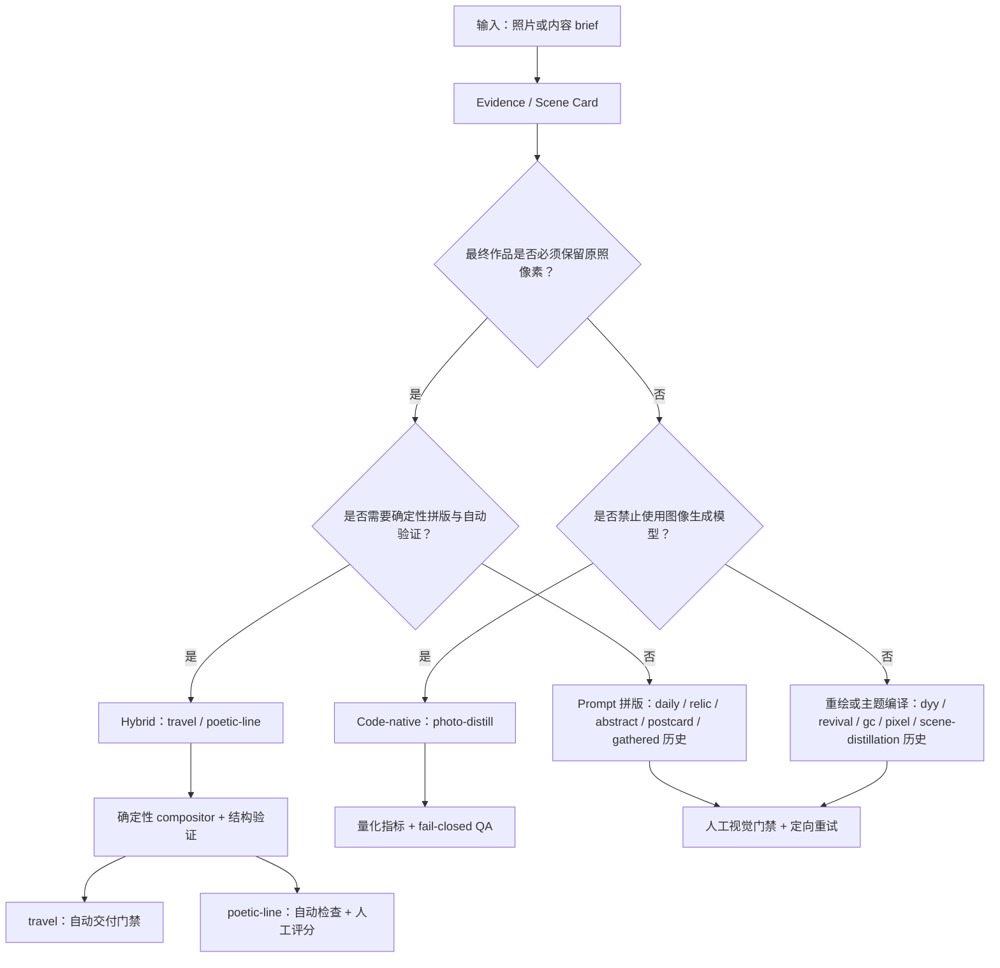

# 技术架构图

> 研究导航：[总索引](RESEARCH-INDEX.md) · [统一原图横评](http://localhost:4317/comparison) · [多原图实验室](http://localhost:4317/labs/multi-source)

## 从输入到交付的路线选择



这张图表达的是实现契约，不是风格分类。同一个“极简 Zine”外观可以由完全不同的后端产生，复现性、可验证性和许可风险也会完全不同。

## Codex Skill 官方承载边界

本研究把“Skill 怎样被 Codex 发现和加载”与“视觉工作流怎样实现”分成两层。根据 [OpenAI 官方 Skill 构建说明](https://learn.chatgpt.com/docs/build-skills)，一个 Skill 目录以必需的 `SKILL.md` 为入口，其中声明 `name` 和 `description`；按需再加载完整说明，并可配套 `scripts/`、`references/`、`assets/` 与 `agents/openai.yaml`。Skill 既可以由用户显式调用，也可以由描述匹配而自动触发。

因此，第三方仓库中的目录形式、提示词和样图不是本研究最终要复制的基础设施。后续原创 Skill 应使用官方承载结构，内部再接入本页定义的 Evidence Card、三种渲染后端与验收契约；上游无许可或限制性许可的实现只作为事实性架构观察，不进入原创 Skill 的代码或资产。

## 六层通用能力

| 层 | 要解决的问题 | 可储备的抽象 | 代表项目 |
| --- | --- | --- | --- |
| L0 输入/触发契约 | 什么请求该用、什么请求不该用？ | 输入类型、适用/不适用、输出形式、权利确认 | 全部项目；`dyy` 和 `photo-revival` 的反例边界较清楚 |
| L1 事实提取 | 照片中哪些事实不能丢？ | 主体、轴线、数量、间隔、重心、遮挡、深度、色彩角色、负空间 | `travel`、`photo-abstract`、`gathered` 历史 |
| L2 关系到标记 | 如何把事实压缩为少量视觉符号？ | silhouette、gesture、mass、path、rhythm、wash、dot、color anchor | `dyy`、`travel`、`poetic-line` |
| L3 视觉语法 | 如何形成可路由而非单一模板的系统？ | layout、type、color、texture、mark family、abstraction level、hard avoids | `gc`、`pixel`、`daily`、`postcard` |
| L4 渲染/合成 | 随机生成和确定性工作怎样分工？ | ImageGen-only、Hybrid compositor、HTML/CSS/SVG backend | `gc`、`travel`/`poetic-line`、`photo-distill` |
| L5 验收/交付 | 哪些失败必须阻止交付？ | 像素忠实、比例、留白/着墨、色锚、缩略图、文字唯一性、输出 hash | `travel`、`poetic-line`、`photo-distill` |

## 建议沉淀的统一中间表示

不应该直接把某个上游 Prompt 复制成自己的基础设施。更可迁移的做法是独立定义一个原创 `Evidence Card`：

```yaml
source:
  path: input.jpg
  sha256: <required>
  rights: owned-or-authorized
  metadata_policy: strip-sensitive-exif

facts:
  subjects:
    - id: subject-1
      kind: person-or-object
      bbox_normalized: [x, y, width, height]
      visual_weight: 0.0-1.0
  axes:
    - direction: horizontal-or-diagonal
      strength: 0.0-1.0
  groups:
    - count: 3
      spacing: irregular
  colors:
    - role: anchor
      sampled_hex: "#RRGGBB"
      source_region: subject-1
  negative_space:
    dominant_region: top-right
  occlusion_and_depth: []

preservation_contract:
  mode: redraw | truthful-photo-plus-panel | code-distillation
  must_keep: []
  may_drop: []
  forbidden_inventions: []

visual_grammar:
  mark_family: silhouette | mass | path | rhythm | halftone
  abstraction_level: restrained | balanced | expressive
  layout: <named-layout>
  typography: <named-type-system>
  color_policy: source-sampled

delivery_contract:
  aspect_ratio: "3:4"
  deterministic_regions: []
  validators: []
  max_generation_attempts: 2
```

这个中间层让同一份照片事实可以送往三种后端，也能明确区分“观察事实”和“创作选择”。

## 三种渲染后端

### 1. ImageGen-only

优点：快速、材料感和复杂插画能力强。缺点：随机性大、文字容易出错、原照可能被重画、规则只能目测执行。

应储备：

- 把 Prompt 写成编译结果，而不是自由散文；
- 分离必须保留的事实、可变风格轴和 hard avoids；
- 每次只针对一个失败原因重试；
- 固定最大尝试次数，避免无边界“抽卡”。

### 2. ImageGen + deterministic compositor

让图像模型只生成最适合它的无字抽象面板，脚本负责：

- 放置原图且保持角色/像素契约；
- 生成准确标题和微字；
- 固定画幅、比例和分区；
- 做像素 diff、背景和角落检查；
- 失败时拒绝输出，而不是带病交付。

确定性合成是 `travel-photo-abstraction` 与 `poetic-line-zine-poster` 最有迁移价值的共同点；前者用自动化 `DELIVERY PASS` 阻止失败交付，后者把自动结构验证与人工给分后的阈值汇总分开处理。

### 3. HTML/CSS/SVG code-native

优点：结构、颜色、坐标和文字可测、可回归、可部署；缺点：材料感和复杂自然形态需要更多手工建模，浏览器/字体版本会影响像素复现。

应储备：

- 用归一化坐标和源图采样色构造 SVG；
- 输出自足 HTML，避免网络字体和外部资源；
- 固定浏览器与字体版本；
- 在 2× 导出前做一次 fail-closed 检查；
- 用容差而不是假设跨平台像素完全一致。

## QA 指标库

| 指标 | 目的 | 最小实现 |
| --- | --- | --- |
| 输入/输出 hash | 保证来源和交付可追踪 | SHA-256 |
| 原照像素忠实度 | 防止承诺保真的区域被重画 | 等比缩放后 crop + pixel diff |
| 画幅与分区比例 | 防止生成结果偏离产品规格 | 宽高和关键边界断言 |
| 留白/着墨率 | 把“极简”变成可测约束 | 纸色容差内像素占比 |
| 色锚面积 | 防止高彩元素过大或不可见 | 目标色相/饱和度区域比例 |
| 缩略图可见性 | 确保小尺度仍读得出主结构 | 160 px 缩略图对比/连通域 |
| 背景均匀与角落检查 | 排除意外纹理、脏边和模型残留 | 角落采样 + 方差阈值 |
| 标题唯一性/拼写 | 避免 ImageGen 文字幻觉 | 脚本排字 + 字符串断言 |
| 敏感元数据 | 防止 EXIF/GPS 进入输出 | 导出前清除并生成审计记录 |

## 选择策略

- 要保留真实摄影证据：优先 Hybrid；Prompt-only 只能在明确验证原照区域后使用。
- 要做可部署、可回归的互动或批量系统：优先 code-native。
- 要探索材料感或快速建立视觉方向：先用许可清楚的 Prompt/ImageGen 项目做基线。
- 要完全重绘照片：先声明“不承诺像素保真”，再用记忆点/最小标记约束可识别性。
- 要形成产品而非单张图：学习 `photo-to-zine-postcard` 的正反面、功能区和 variant 思路。
- 任何限制性或无许可项目：只学习可概括的思想，不复制表达、代码、资产或完整规则文本。
