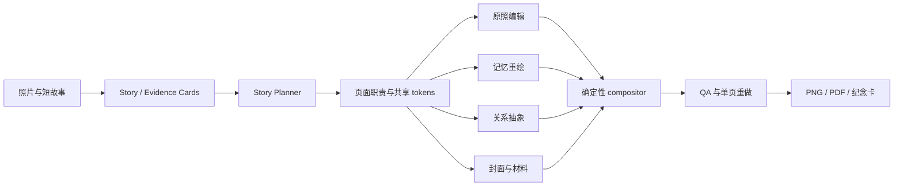

# StoryFold 产品定义

## 一句话产品

**StoryFold 把 4–8 张照片和一段短故事，变成一套有连续叙事、可保存和可分享的六页视觉小志。**

多个图片 Skill 在后台负责理解、重绘、抽象、拼贴、封面和产品化；用户只选择故事方向，不需要理解 Skill 或模型。

## 目标用户与任务

第一版优先服务有一组自有照片、想做出比模板相册更有表达力成品的人，例如旅行记录者、家庭故事整理者、摄影师和小型文化内容团队。

核心任务：

> 当我有几张属于同一段经历的照片时，帮我把它们组织成一套有开场、展开、转折和收束的视觉作品；重要照片和真实文字不能丢，允许变化的页面可以更有想象力。

这只是暂定用户与任务，当前证据等级为 D0。

## 输入与输出

### 输入

- 4–8 张自有、合成或明确授权的照片。
- 一个标题和不超过 120 字的故事。
- 可选的人物、地点、时间标签。
- 每张照片的转换权限：`必须原样`、`允许重绘` 或 `允许抽象`。
- 用户确认的照片顺序；系统可以建议，但不能静默改写事实顺序。

### 输出

- 两套六页故事板：**现场叙事**与**记忆叙事**。
- 选定后的六张 4:5 页面 PNG。
- 一张独立封面 PNG。
- 一组 2:3 数字纪念卡正反面。
- 一个 PDF / ZIP 交付包，包含真实文字、页面顺序和来源记录。

## 用户流程

1. 用户上传照片并填写短故事。
2. 用户标记每张照片可以怎样被处理。
3. 系统生成 Story Card、Evidence Card 和页面角色建议。
4. 用户确认照片顺序与不可丢失信息。
5. 系统给出“现场叙事”和“记忆叙事”两套六页故事板。
6. 用户选定一套并生成完整页面。
7. 用户可单独重做某一页，不影响已确认页面。
8. 系统完成确定性排字、原照合成和 QA 后导出成品。

## 两套叙事路线

### 现场叙事

- 更多页面保留完整原照。
- 强调地点、人物、动作和事件顺序。
- 视觉变化主要发生在构图、色场、拼贴和文字层。
- 适合旅行、活动、纪实和摄影故事。

### 记忆叙事

- 更多页面使用允许重绘的照片、关系 mark 和抽象过场。
- 强调情绪、回忆、距离和时间感。
- 原照仍作为证据页或 relic 保留，不把重绘冒充原始记录。
- 适合家庭记忆、纪念、个人故事和文化叙事。

两条路线共享同一事实、文字、照片顺序和视觉 token，不是两组随机风格。

## 六页页面系统

| 页 | 页面职责 | 主要能力 | 确定性内容 |
| ---: | --- | --- | --- |
| 1 | 封面 / 故事命题 | 单一隐喻、语义蒸馏、可选点阵材料 | 标题、署名、来源色 |
| 2 | 现场开场 | 编辑摄影、原照锁定 | 完整照片、短说明 |
| 3 | 场景展开 | 多照片排序、连续拼贴 | 成员顺序、页码 |
| 4 | 记忆转折 | 记忆重绘或“原照 + relic” | 原照标签、事实说明 |
| 5 | 关系过场 | 事实抽象、最少 mark、代码图形 | 数据 / 关系标签 |
| 6 | 收束 / 留言 | 明信片封装、来源色回收 | 结束语、日期 / 地点 |

## 后台能力架构

### 1. Story Planner

职责：把用户确认的照片顺序分配为开场、展开、转折和收束，生成两套故事板。它只组织已知事实，不推断人物关系或虚构事件。

### 2. Page Renderer

按页面职责选择原创实现的渲染策略：

- `locked-photo`：原照为主，只改变编辑结构。
- `scene-collage`：多张照片按确认顺序拼贴。
- `memory-redraw`：只处理明确允许重绘的照片。
- `relation-abstract`：把已确认的方向、间隔、数量和色锚转成 mark。
- `cover-metaphor`：把故事命题压成一个视觉隐喻。
- `halftone-material`：作为封面或重点页的材料层，不单独成为产品。

### 3. Deterministic Compositor

生成模型只负责不含真实文字的视觉层；原创合成器负责：

- 放回必须原样的照片区域。
- 使用真实字体渲染标题、正文、日期和页码。
- 锁定 4:5 与 2:3 比例、安全区和页面顺序。
- 应用统一颜色、mark family、字体和留白 token。
- 记录每个输出来自哪张照片和哪个页面版本。

### 4. QA

第一版只检查可以明确判定的项目：

- 输入照片是否成功载入，来源 hash 是否可追踪。
- 必须原样的照片区域是否被替换或裁掉关键主体。
- 页面数量、顺序、尺寸、比例和安全区是否正确。
- 真实文字是否来自用户输入，是否溢出或缺失。
- 共享视觉 token 是否应用到每一页。
- 缩略图下是否仍有清楚层级。

审美、人物身份、历史事实、授权真实性和法律合规必须由人负责，产品不能自动证明。

## 核心数据对象

| 对象 | 作用 | 关键字段 |
| --- | --- | --- |
| Story Project | 一次完整作品 | title、summary、sequence、route、status |
| Source Photo | 输入照片 | path、hash、permission、people / place / time、role |
| Evidence Card | 不可丢失事实与视觉关系 | must_keep、subjects、axes、groups、colors、negative_space |
| Storyboard | 六页叙事提案 | route、page_roles、photo_assignments、shared_tokens |
| Page Recipe | 一页的制作契约 | renderer、sources、text、deterministic_regions、validators |
| Generated Layer | 可变化的视觉层 | model / method、prompt version、seed、output |
| Page Version | 合成后的页面 | assets、layout version、QA result、approval |
| Export Bundle | 最终交付 | six_pages、cover、postcard、PDF、manifest |

## MVP 必须有

- Story / Evidence Card。
- 两套固定为六页的故事板。
- 封面、原照、拼贴、记忆、关系、收束六种页面职责。
- 至少四类原创渲染能力：封面、原照编辑、记忆重绘、关系抽象。
- 无字视觉层与真实文字 / 原照确定性合成分离。
- 跨页共享 token 与照片顺序锁定。
- 单页重做、页面版本和基础 QA。
- PNG、数字纪念卡与 PDF / ZIP 导出。

## MVP 暂不做

- 自由画布、任意页数、多用户协作或模板市场。
- 让用户直接选择 Skill、仓库、模型或 Prompt。
- 自动补写人物关系、历史事实、地点事件或授权状态。
- 面孔相似与身份保证。
- 实体印刷、装订、二维码、邮寄和付款。
- Campaign Forge 或 Evidence Canvas 的完整产品形态。

## 产品原则

1. **成品优先**：用户得到的是连续图片作品，不是能力说明或检查报告。
2. **Skill 隐身**：按页面职责编排能力，不向用户暴露技术目录。
3. **原照与重绘分约**：证据照片和记忆图不能混成一种真实性承诺。
4. **先结构后生成**：先确认故事、顺序和页面职责，再生成视觉层。
5. **真实内容后合成**：文字、照片和页码由确定性代码处理。
6. **一页失败只重做一页**：版本与缓存边界以页面为单位。
7. **不虚构证明**：产品不把视觉推断写成人物、历史、权利或法律事实。

## 成功标准

### 无用户对象阶段的工程标准

- 同一输入能稳定得到两套六页、角色完整且顺序一致的故事板。
- 必须原样的照片在最终页面中可追踪，缺失时 fail closed。
- 所有真实文字都由确定性排字产生，无生成乱码。
- 单页重做不会改变其他已确认页面。
- 六页、封面和纪念卡共享同一视觉 token 并通过尺寸 / 结构检查。

### 有用户对象后的产品标准

- 用户能在不理解 Skill 名称的情况下说明两条路线差异并作选择。
- 成品相较普通模板相册更能表达故事，同时没有破坏不可丢失事实。
- 用户愿意补充必要事实和转换权限，并愿意保存或分享成品。
- 单页重做与导出流程没有制造不可接受的等待和返工。
