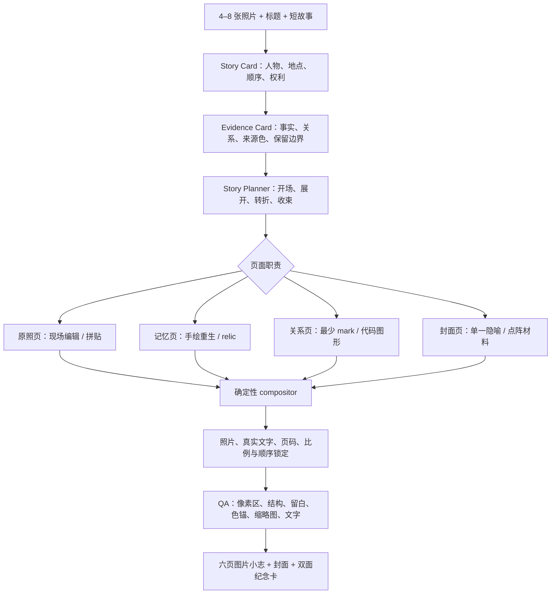

# 多 Skill 产品组合：StoryFold

## 结论

子项目研究的 13 个图片 Skill 不是 13 个平行滤镜。它们已经覆盖一条完整生产链：

> 照片理解 → 事实与关系提取 → 情绪 / 记忆 / 材料转译 → 图片生成 → 确定性拼版 → 产品封装 → QA。

因此新产品不让用户逐个选择 Skill，而是在后台按页面职责组合这些能力，最终交付一套连续图片作品。

当前产品方向为 **StoryFold：照片故事成品机**。

用户上传 4–8 张照片和几句说明，产品生成一套六页视觉小志、封面和双面纪念卡。每一页使用不同能力，但共享同一故事、人物顺序、来源色、文字系统和视觉语法。

## 研究依据与边界

Skill Zine Summary 当前记录：

- 12 个去重仓库、13 个图片 Skill；
- 127 组本地 SOURCE → EFFECT；
- 57 个来源路径；
- 129 个静态效果与 2 个实时实验；
- 13 个 Revision 12 产品系统数字预演；
- 从输入契约到验收交付的六层通用能力模型。

来源见 [INVENTORY.md](../skill-zine-summary/INVENTORY.md)、[TECHNICAL-MAP.md](../skill-zine-summary/TECHNICAL-MAP.md) 和 [Revision 12](../skill-zine-summary/lab/web/REVISION12-PRODUCT-SYSTEMS.md)。

这些证据可以支持“能力能够怎样组合”，但不能证明目标用户需求、付费、实体生产或所有上游 Skill 的稳定运行。大量本地效果是依据公开高层方法制作的概念研究，不等于直接执行了全部上游实现。

## 用户看见什么

用户只处理四件事：

1. 上传一次旅行、活动或记忆中的 4–8 张照片。
2. 补充标题、人物 / 地点 / 时间和 1–3 句故事。
3. 确认哪些照片必须原样保留，哪些允许重绘或抽象。
4. 在“现场叙事”和“记忆叙事”两套故事板中选择一套，再生成完整图片成品。

用户不会看见仓库名、Skill 名称、模型列表或后端实现。

## 能力如何在后台分工

| 产品能力 | 研究来源 | 在 StoryFold 中的职责 | 不能继承的承诺 |
| --- | --- | --- | --- |
| 多照片排序与场景卡 | Scenes Gathered | 识别开场、人物 / 地点、转折和收束，维护成员与照片顺序 | 不猜测人物关系、事件顺序或授权状态 |
| 事实与关系提取 | Photo Abstract、Travel | 为每张照片记录主体、轴线、数量、重心、来源色和不可丢失事实 | 编辑解释不等于历史、工程或业务事实 |
| 封面命题与视觉隐喻 | GC Minimal、Scene Distillation | 把整组故事压成一个封面命题、色锚和中心张力 | 不把隐喻写成事实，不使用生成文字作最终排字 |
| 现场编辑页 | Daily、Scenes Gathered | 保留照片证据，用来源色、几何和拼贴形成编辑层级 | 图片窗默认不等于像素保真，必须由自有合成器锁定 |
| 记忆重绘页 | Photo Revival、Photo Relic | 将允许重绘的照片变成手绘记忆或“照片 + relic”双时间画面 | 不保证面孔、年代、物件数量或身份相似 |
| 抽象过场 / 关系页 | DYY、Photo Abstract、Photo Distill | 把动作、方向、间隔、节奏和色锚转成最少 mark 或代码图形 | 不能替代真实数据、测绘或读者理解测试 |
| 材料化视觉 | Pixel Style | 为封面或重点页增加点阵、半调和有限套色语言 | 屏幕半调不等于真实网印与纸张证明 |
| 原照、文字与结构合成 | Travel、Poetic Line 的高层架构 | 让生成模型只做无字视觉层；代码负责照片、标题、页码、比例和成员顺序 | 不复制限制许可或无许可实现；必须原创实现 |
| 双面纪念卡 | Photo to Zine Postcard | 把故事封面和来源色发展成 2:3 正反面数字纪念卡 | 首版不声称已通过打印、裁切、书写、二维码或邮寄测试 |
| QA 与失败拒绝 | Travel、Poetic Line、Photo Distill | 检查来源 hash、照片区、比例、留白、色锚、缩略图和文字 | 自动检查不负责审美、身份、权利和故事真实性 |

## 13 个 Skill 如何进入当前图片结果方向

Image Product Studio 不把 Skill 作为按钮暴露给用户，而是把研究得到的能力映射到可预览、可选择的结果。一个方向可以组合多个 Skill，同一个 Skill 也可以服务不同产品。

| 研究 Skill | 当前主要结果方向 | 可见贡献 |
| --- | --- | --- |
| Scenes Gathered | 多图场景融合、叙事续帧展开、实景编辑重构 | 多图关系、顺序、场景连续性 |
| Photo Abstract | 结构拆解重组、局部证据放大、诗性关系图 | 主体、方向、群组和来源色提取 |
| Travel | 实景编辑重构、局部证据放大、结构拆解重组 | 事实锚点、原图保留与编辑结构 |
| GC Minimal | 场景想象重构、主体提炼 | 单一视觉锚点、留白和隐喻压缩 |
| Scene Distillation | 场景想象重构、叙事续帧展开、视觉指纹系统 | 场景本质、关系轴线与视觉聚焦 |
| Daily Photo Playground | 实景编辑重构、结构拆解重组 | 原图窗口、几何层级与编辑节奏 |
| Photo Revival | 记忆重绘重生、场景想象重构 | 手绘重生、环境再想象和时间层次 |
| Photo Relic | 记忆重绘重生、局部证据放大 | 原图证据、照片遗迹和双时间画面 |
| DYY | 结构拆解重组、视觉指纹系统 | 轮廓、群组、路径和最小图形零件 |
| Photo Distill | 视觉指纹系统、主体提炼 | 可复用标记、密度与主体特征 |
| Pixel Style | 材料化发布 | 网点、有限套色和材料质感 |
| Poetic Line | 多图场景融合、叙事续帧展开、诗性关系图 | 路径、间隔、节奏与关系表达 |
| Photo to Zine Postcard | 系列卡 / 明信片产品适配 | 正反面结构、来源色和系列编号 |

这张映射是产品编排依据，不代表当前浏览器探测版已把 13 个上游实现全部作为运行依赖接入；在线视觉理解与生成仍是下一阶段的真实服务边界。

## 端到端产品链



## 六页产品结构

| 页 | 叙事职责 | 主要能力组合 | 输出 |
| ---: | --- | --- | --- |
| 1 | 封面 / 故事命题 | GC Minimal + Scene Distillation；可选 Pixel 材料层 | 标题、单一视觉锚点、来源色 |
| 2 | 现场开场 | Daily + Travel 式原照锁定 | 完整照片、编辑色场、短说明 |
| 3 | 场景展开 | Scenes Gathered + 确定性成员顺序 | 2–3 张照片的连续拼贴 |
| 4 | 记忆转折 | Photo Revival 或 Photo Relic | 一张允许重绘的记忆图 |
| 5 | 关系过场 | Photo Abstract + DYY / Photo Distill | 无照片或照片 + mark 的关系页 |
| 6 | 收束 / 留言 | Postcard 产品契约 + 来源色 | 结束语、日期 / 地点、纪念卡入口 |

“现场叙事”会增加第 2、3 页的原照比重；“记忆叙事”会增加第 4、5 页的重绘和抽象比重。两条路线共用同一事实、顺序和文字，不是六种互不相关的风格。

## 统一中间结构

产品不复制任一上游 Prompt，而是原创实现统一 `Story Card` 与 `Evidence Card`：

```yaml
story:
  title: ""
  summary: ""
  people_and_places: []
  sequence: []
  rights_confirmed: false

source:
  path: input.jpg
  sha256: ""
  role: opening | scene | turning-point | closing

facts:
  must_keep: []
  subjects: []
  axes: []
  groups: []
  colors: []
  negative_space: ""

transformation:
  mode: locked-photo | memory-redraw | relation-abstract | cover-metaphor
  may_change: []
  forbidden_inventions: []
  mark_family: silhouette | mass | path | rhythm | halftone

page:
  index: 1
  aspect_ratio: "4:5"
  text: ""
  deterministic_regions: []
  validators: []
```

## MVP

### 输入

- 4–8 张自有、合成或明确授权照片；
- 一个标题和不超过 120 字的故事；
- 人物 / 地点 / 时间标签；
- 每张照片的“必须原样 / 允许重绘 / 允许抽象”选择。

### 输出

- 两套六页故事板预览：现场叙事、记忆叙事；
- 选定后生成六张 4:5 页面 PNG；
- 一张独立封面 PNG；
- 一组 2:3 数字纪念卡正反面；
- 一个包含真实文字、来源记录与页面顺序的 PDF / ZIP 交付包。

### 首版必须有

- Story / Evidence Card；
- 页面职责分配和照片顺序确认；
- 封面、原照页、记忆页、关系页四类原创渲染能力；
- 无字生成层与确定性文字 / 原照合成分离；
- 跨页来源色、mark family、字体和留白 token；
- 单页重做，不重新生成整本；
- 来源照片区、尺寸、结构与文字 QA。

### 首版不做

- 13 个 Skill 按钮、模型市场和第三方 Skill 安装；
- 任意页数、自由画布或通用设计代理；
- 自动猜测人物关系、事件顺序或历史事实；
- 面孔相似、文物修复、纪实真实性或法律合规保证；
- 实体印刷、装订、二维码和邮寄承诺。

## 原创与许可边界

- 上游 Skill 只作为研究输入，不作为 13 个运行依赖打包。
- MIT 项目即使允许复用，也需要保留许可与署名；第一版优先原创统一实现，避免形成碎片化依赖。
- 无正式许可证、限制许可和历史快照项目只提炼可概括的高层方法，不复制代码、Prompt、模板、样图或专有表达。
- 研究站中的 SOURCE、EFFECT 和 PRODUCT SYSTEM 多数是本地研究或数字预演；进入产品样例前必须逐项确认发布权利。
- 产品自己的实现、测试数据、生成素材和模型条款在本项目内单独记录，不依赖兄弟目录运行。
