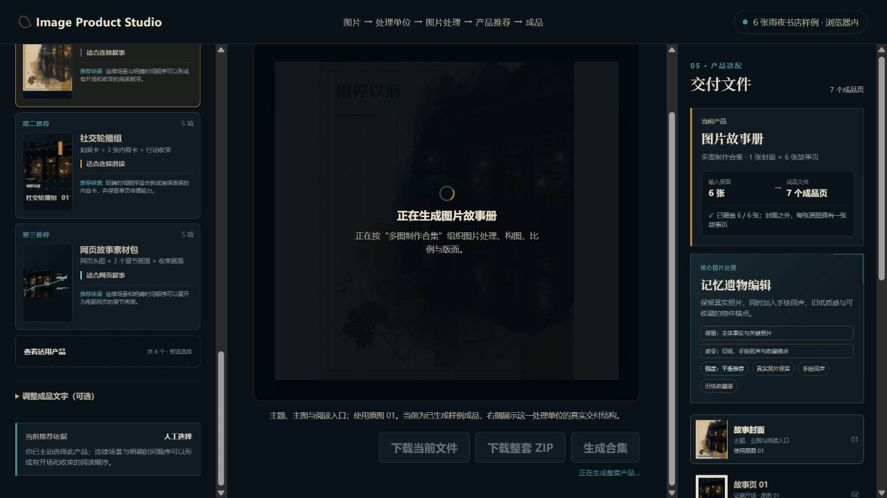

# Image Product Studio · Revision 15 产品体验审查

- 日期：2026-08-12
- 范围：电脑网页版，从默认样例进入，到产品推荐、完整目录、生成和下载状态
- 用户目标：导入一张或多张图片，不理解内部 Skill，也能选择合适的成品并得到可下载结果

## 总体判断

当前版本已经形成可理解的完整闭环，视觉结果也比早期固定拼图明确得多。主要问题已经从“有没有产品”转为“推荐是否真正可信、用户能否比较结果、生成后能否继续控制”。下一阶段不应先扩充大量产品名称，而应先补齐真实图片理解、候选结果比较和局部修改。

## 流程证据

### 1. 默认进入 · 健康但状态边界不够清楚

- 优点：无需输入即可看到完整样例；中央结果清楚，右侧交付数量明确。
- 风险：中央已经像完成品，但下载不可用，按钮却叫“生成合集”。用户难以判断眼前是最终结果、样例结果还是待生成预览。
- 建议：把状态明确拆成“推荐预览 → 生成正式结果 → 可下载”，每个阶段只保留一个主动作。

### 2. 查看推荐 · 依据清楚，但流程过长

- 优点：前三产品均有数量、用途和推荐依据，右侧结构同步。
- 风险：左栏需要独立滚动很长距离才能到达 04；推荐卡文字偏小。点击已经选中的自动推荐，会被错误标成“人工选择”。
- 建议：已完成的 01–03 折叠为摘要或提供步骤定位；只有切换到不同产品时才记录为人工选择。

### 3. 完整目录 · 产品齐全，但比较成本较高

- 优点：六个合集产品同屏，当前选择、页数和适用场景清楚。
- 风险：缩略图和推荐理由太小，所有产品使用同一组素材时视觉差异不易比较；用户仍需逐张阅读文字才能选择。
- 建议：选择某项时在弹窗内提供大图预览，支持“当前首选 vs 备选”双栏比较，并突出构图、用途、文件数量三个差异。

### 4. 生成中 · 反馈明确，但真实能力边界待补

- 优点：遮罩、加载反馈和当前任务名称明确，误操作风险低。
- 风险：没有说明预计耗时、当前阶段，也没有真实 AI 生成与本地排版之间的区别。
- 建议：真实后端接入后显示“理解图片 / 生成视觉 / 排版导出”阶段；当前探测版则把动作改成更诚实的“制作可下载文件”。

### 5. 生成完成 · 下载清楚，但缺少结果修正

- 优点：当前 PNG、整套 ZIP 和重新生成三个动作清楚，交付数量一致。
- 风险：用户只能整套重新生成，不能修改封面图、图片顺序、单页裁切或只重做一页。
- 建议：增加“调整结果”入口，支持更换封面、排序、焦点裁切、标题修改、单页重做与版本对比。

## 优先级建议

### P0 · 决定产品是否真正成立

1. 接入用户上传图片的视觉理解：判断主体、顺序、重复、比例、质量与图片关系，再给出产品和图片处理建议。
2. 明确预览、生成、完成三种状态；避免“已经像成品，但还要生成”的含混体验。
3. 修复点击当前首选后被标成“人工选择”的推荐来源错误。

### P1 · 让用户能够选择和修正结果

1. 提供 2–3 个大图候选结果，可快速切换或并排比较后再生成。
2. 把长左栏改为分阶段展开：完成的步骤折叠成摘要，当前步骤保持展开。
3. 生成后支持封面、顺序、裁切、文字和单页重做；保留旧版本以便撤回。
4. 为混合横竖图、低分辨率、重复图片和缺失主题提供输入质量提示。

### P2 · 形成可长期使用的产品

1. 保存项目、继续编辑、版本历史和最近结果。
2. 增加 JPG / WebP / PDF、尺寸预设、社交平台规格和文件命名规则。
3. 在核心闭环稳定后，再扩展电商详情图、品牌社交套件、活动回顾报告、分镜板、作品集和教学信息图等目标。

## 可访问性与验证边界

- 截图可见的侧栏说明、推荐理由和目录正文偏小、对比度偏低，建议提高基础字号和次级文本亮度。
- 三栏独立滚动会增加键盘和低视力用户的定位成本；需要后续完整测试 Tab 顺序、焦点可见性、200% 缩放和屏幕阅读器朗读。
- 本次没有验证真实本地文件选择、在线 AI、网络失败、超大图片和长时间生成。
