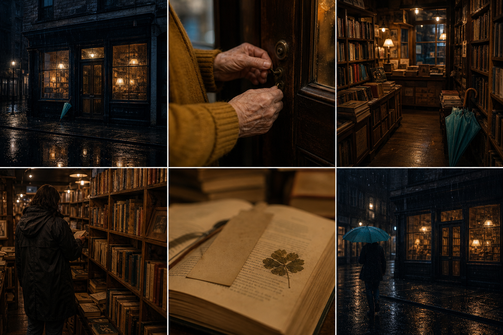
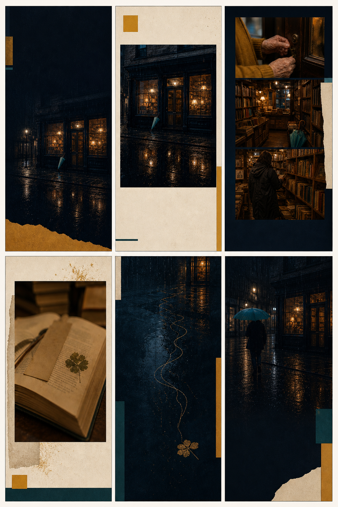
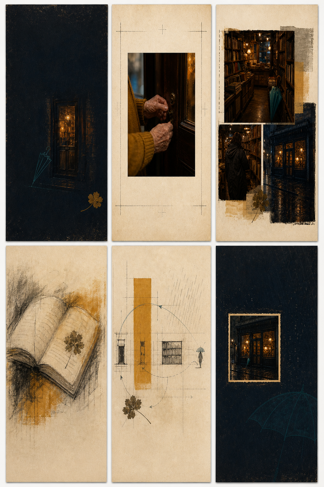
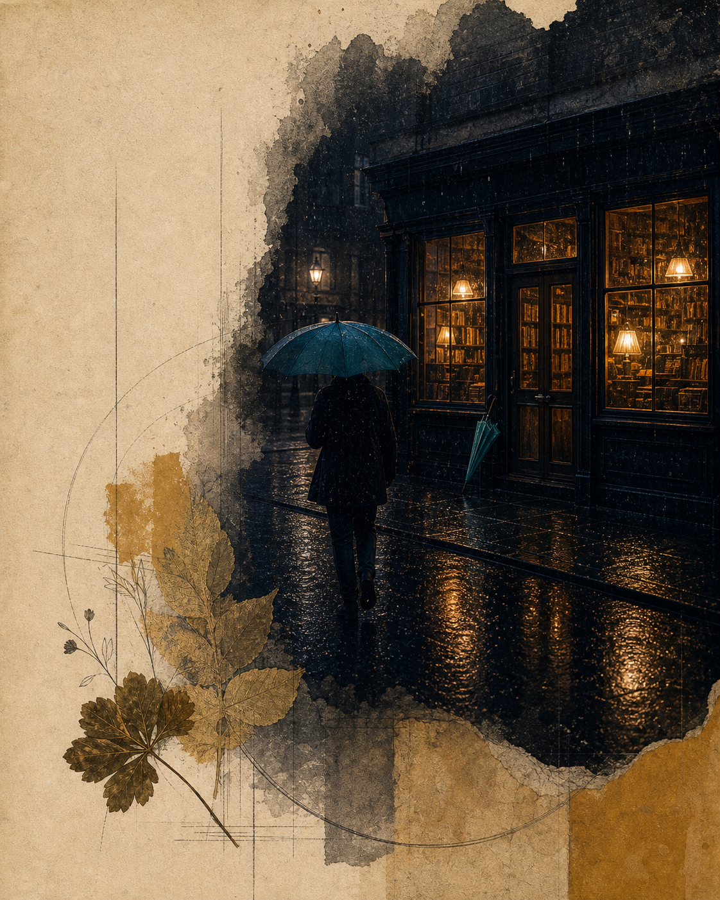

# 受控样本 01：雨停以前

## 样本目的

这是 StoryFold 的第一份受控内容样本，用于验证：同一组照片能否在不改变基本事实的前提下，被多个图片能力组合成两套职责完整、视觉一致的六页故事。

样本中的照片和人物均为 AI 合成，不对应真实身份、地点或品牌。它只构成 D0 内容 / 工程证据，不构成用户需求、像素保真、实体印刷或商业可用性证明。

## 视觉结果

### 输入照片组



### 现场叙事



### 记忆叙事



### Image Product Studio 独立封面



该图是 2026-08-12 为产品首屏重新生成的单张 4:5 无字视觉层。它不再把六页概念 sheet 当成单页成品；真实标题由浏览器 Canvas 叠加。

## Story Card

```yaml
title: 雨停以前
summary: >
  雨夜，一位访客走进即将打烊的旧书店。在一页旧书中看见一片压叶，
  停留片刻，随后撑伞离开。门内的灯仍然亮着。
people:
  - 年长书店主人；不显示面孔，不推断身份
  - 独自来访者；只从背影出现，不推断身份或关系
place: 虚构城市旧书店
time: 雨夜，临近打烊
sequence:
  - 雨中的店外
  - 主人开门
  - 书店内部
  - 访客浏览
  - 旧书与压叶
  - 访客离开
rights: 全部素材为本次项目生成的合成图片
```

## Evidence Cards

| 来源 | 位置 | 页面事实 | 必须保留 | 允许变化 | 权限 |
| --- | --- | --- | --- | --- | --- |
| P01 | 左上 | 雨夜店外，室内暖光，青绿色雨伞 | 店面、雨、冷暖对比 | 裁切、色场、封面抽象 | 原照优先 / 可抽象 |
| P02 | 中上 | 芥末色袖口的年长双手开锁 | 双手、门锁、袖口；不出现面孔 | 纸张边框、登记线 | 必须原样 |
| P03 | 右上 | 暖光书架与入口处雨伞 | 书架、暖光、青绿色雨伞 | 拼贴、局部裁切 | 原照优先 |
| P04 | 左下 | 深色雨衣访客背对镜头浏览 | 单人、背影、书架 | 拼贴、编辑裁切 | 必须原样 |
| P05 | 中下 | 打开的旧书、空白书签与压叶 | 书、空白纸、压叶 | 手绘、材料化、关系抽象 | 允许重绘 / 抽象 |
| P06 | 右下 | 访客撑伞离开，店铺仍亮 | 单人、青绿色雨伞、暖光店面 | 裁切、缩小为照片遗迹 | 必须原样 |

## 两套 Storyboard

### 现场叙事

| 页 | 职责 | 来源 | 能力组合 | 预留真实文字 |
| ---: | --- | --- | --- | --- |
| 1 | 封面 | P01 | 原照编辑 + 极简隐喻 | 标题《雨停以前》 |
| 2 | 证据开场 | P01 | 大幅原照 + 编辑色块 | 一句时间 / 地点 |
| 3 | 场景展开 | P02、P03、P04 | 多照片顺序拼贴 | 三个短说明 |
| 4 | 转折 | P05 | 原照 relic + 纸张材料 | 压叶的故事句 |
| 5 | 关系过场 | P01、P05 | 雨线、路径与叶形 mark | 无或一行短句 |
| 6 | 收束 | P06 | 原照 + 纪念卡式留白 | 结束语、日期 |

### 记忆叙事

| 页 | 职责 | 来源 | 能力组合 | 预留真实文字 |
| ---: | --- | --- | --- | --- |
| 1 | 记忆封面 | P01、P05 | 暖门、伞迹、压叶的单一隐喻 | 标题《雨停以前》 |
| 2 | 证据锚点 | P02 | 原照 relic + 档案登记线 | 一句开门说明 |
| 3 | 场景聚合 | P01、P03、P04 | 有序档案拼贴 | 场景短句 |
| 4 | 记忆转折 | P05 | 炭笔重绘 + 琥珀色 wash | 压叶的故事句 |
| 5 | 关系蒸馏 | P01–P06 | 门槛、浏览路径、雨与离开的 mark | 无或一行短句 |
| 6 | 记忆收束 | P01、P06 | 小幅照片遗迹 + 退去的伞形 | 结束语、日期 |

## 共享视觉 Tokens

| Token | 值 / 规则 |
| --- | --- |
| `rain-navy` | 深雨蓝，作为暗底与室外时间锚点 |
| `lamp-amber` | 灯光琥珀色，作为室内与记忆锚点 |
| `paper-cream` | 旧纸米白，作为证据、留白与档案层 |
| `umbrella-teal` | 青绿色，仅用于雨伞、路径或小面积强调 |
| `mustard-trace` | 芥末色，仅追踪开门者袖口与次级几何块 |
| `mark-family` | 细雨线、门槛矩形、单一路径、压叶轮廓 |
| `type-policy` | 图片生成阶段无字；真实中文由 compositor 后合成 |

## 当前观察

- 六个页面职责可以从同一照片组中建立，不需要新增人物或事件。
- 现场版主要依靠完整照片、顺序和编辑结构；记忆版主要依靠 relic、手绘和关系 mark，路线差异可见。
- 两套路线共享雨蓝、琥珀、纸白、青绿雨伞和压叶符号，因此没有完全变成随机风格拼盘。
- P02、P04、P06 被定义为必须原样；当前概念图只表现了这一意图，尚未通过确定性像素合成验证。
- 所有文字区故意留空，避免把生成文字当最终排字。

## 尚未证明

- 这两张六页图是视觉概念 sheet，不是六张独立的真实 4:5 页面导出。
- ImageGen 使用了来源照片作为参考，但没有证明像素级原照锁定。
- 真实标题、正文、页码和安全区尚未由 compositor 合成。
- 尚未执行来源 hash、像素区域、文字溢出、单页重做或 PDF / ZIP 导出测试。
- 尚无用户判断哪条路线更易懂、更有价值或值得分享。

## 最终提示集

本样本使用内置 ImageGen 生成。以下为最终提示的产品级摘要；完整事实与页面契约以上方 Story / Evidence Cards 和 Storyboard 为准。

### 输入照片组

```text
Create six distinct natural editorial photographs from the same fictional rainy-night independent bookstore as a 3×2 contact sheet: rainy exterior, elderly hands unlocking the door, warm aisle, visitor browsing from behind, open book with pressed leaf, and rainy departure. Keep the same amber lamps, deep blue rain, worn wood, mustard sleeve and teal umbrella. Fictional people only, no visible faces, readable text, logos, captions or watermark.
```

### 现场叙事

```text
Using the source contact sheet as factual reference, create a 3×2 presentation of six portrait 4:5 zine pages: minimal photographic cover, large evidence opener, ordered three-photo scene collage, book-and-leaf turning point, traceable rain-path relation page, and photographic closing. Keep source imagery photographic; share rain navy, lamp amber, paper cream, teal and mustard tokens. No readable text, faces, new people or invented events.
```

### 记忆叙事

```text
Using the same source contact sheet as factual anchor, create a 3×2 presentation of six portrait zine pages: memory cover, photographic unlocking-hands evidence, ordered archival collage, charcoal-and-amber redraw of the book and pressed leaf, abstract map of rain/threshold/browsing/departure, and closing photo relic. Combine photographic evidence, charcoal, translucent wash, paper and restrained marks. No readable text, faces, new people or invented facts.
```

### 独立成品封面

```text
Create one standalone vertical 4:5 editorial photo-story cover from the rainy bookstore source. Use the warm lit storefront, rain reflections and teal umbrella as the main anchor; combine premium editorial photography with tactile archival paper, restrained graphite memory traces and pressed-leaf motifs. Preserve quiet space for later real Chinese typesetting. No text, logos, UI, mockup, contact sheet, grid or frame-within-frame.
```
